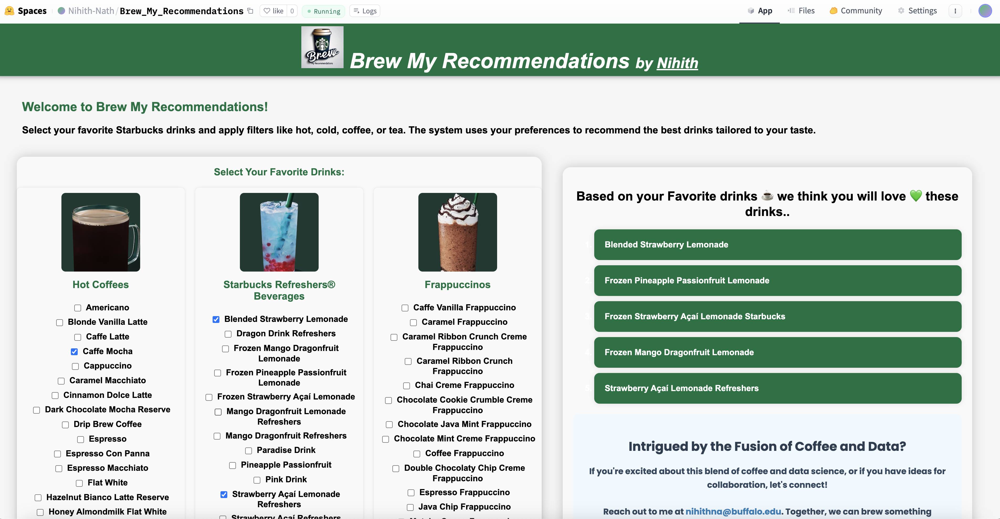

# [Brew My Recommendations](https://huggingface.co/spaces/Nihith-Nath/Brew_My_Recommendations)

## Overview
"Brew My Recommendations" is a personalized Starbucks drink recommendation system web application. It recommends new drinks to users based on their preferences and previously liked drinks. The system uses K-means inspired algorithm to identify similar drinks and suggest the closest matches to the user's selected preferences.

## Live Demo
Check out my recommendation system [Brew my Recommendations](https://huggingface.co/spaces/Nihith-Nath/Brew_My_Recommendations).

## Screenshot

## Features
- **Personalized Recommendations**: Get drink recommendations tailored to your taste.
- **Interactive UI**: Easily select preferences and view recommended drinks.
- **Filter Options**: Filter recommendations by hot/cold drinks and caffeine/no caffeine options.
- **Dynamic Updates**: Recommendations update dynamically as preferences are changed.

## Project Structure
The project consists of the following key files:
- `app.py`: Contains the Flask application setup and route definitions.
- `main.py`: Handles the recommendation logic and data processing.
- `index.html`: The front-end interface for user interaction.
